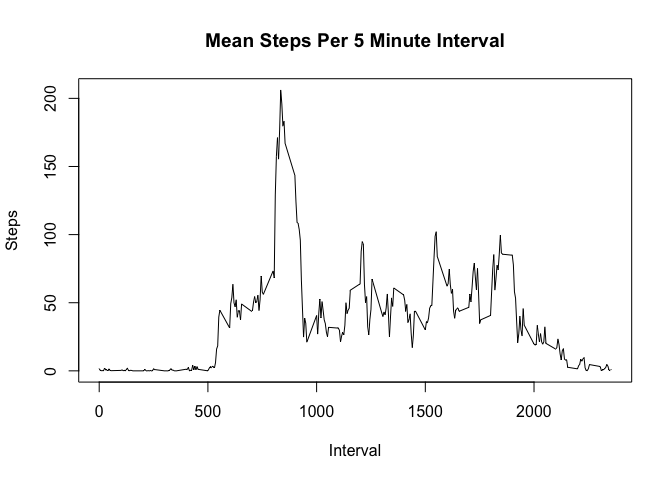
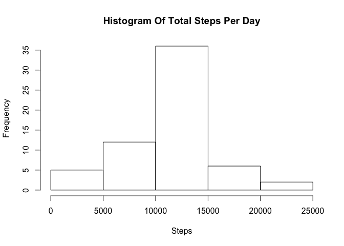

# Reproducible Research: Peer Assessment 1
===============================================================================

### 1. Load and preprocess the data
#### 1.1.  Start by loading the data 


```r
if(!file.exists('activity.csv')){
    unzip('activity.zip')
}
activity <- read.csv("activity.csv")
```

#### 1.2. Let's explore it a bit

```r
str(activity)
```

```
## 'data.frame':	17568 obs. of  3 variables:
##  $ steps   : int  NA NA NA NA NA NA NA NA NA NA ...
##  $ date    : Factor w/ 61 levels "2012-10-01","2012-10-02",..: 1 1 1 1 1 1 1 1 1 1 ...
##  $ interval: int  0 5 10 15 20 25 30 35 40 45 ...
```

```r
summary(activity)
```

```
##      steps                date          interval     
##  Min.   :  0.00   2012-10-01:  288   Min.   :   0.0  
##  1st Qu.:  0.00   2012-10-02:  288   1st Qu.: 588.8  
##  Median :  0.00   2012-10-03:  288   Median :1177.5  
##  Mean   : 37.38   2012-10-04:  288   Mean   :1177.5  
##  3rd Qu.: 12.00   2012-10-05:  288   3rd Qu.:1766.2  
##  Max.   :806.00   2012-10-06:  288   Max.   :2355.0  
##  NA's   :2304     (Other)   :15840
```
#### Takeaways:
* 'date' is coded as a factor and there are 61 days
* Each day seems to have 288 intervals (let's confirm)
* 17568 observations in total
* The max interval is 2355, so it cycles up at 60 mins and can be interpreted as a 24hr time

#### Confirm the relationship between date, interval and total observations
If each day (61) has 288 intervals then their product should be observations (17568)

```r
61 * 288
```

```
## [1] 17568
```
It is! So let's save totalDays for later use  

```r
print(totalDays <- nrow(activity) / length(unique(activity$interval)))
```

```
## [1] 61
```

#### 1.3. Finally, let's transform the date field using Lubridate

```r
library(lubridate, quietly=TRUE)
activity$date     <- ymd(activity$date)
```


===============================================================================  

### 2. What is mean total number of steps taken per day?
#### 2.1. Calculate the total number of steps taken per day 

```r
library(plyr, warn.conflicts=FALSE)
totalDailySteps <- ddply(activity, c("date"), summarize, steps = sum(steps))
```

#### 2.2. Make a histogram of the total number of steps taken each day

```r
hist(totalDailySteps$steps, 
     main="Histogram Of Total Steps Per Day", 
     xlab="Steps")
```

 

#### 2.3. Calculate and report the mean and median of the total number of steps taken per day

```r
rawMean   <- mean(totalDailySteps$steps, na.rm=TRUE)
rawMedian <- median(totalDailySteps$steps, na.rm=TRUE)
```
The mean and median of the total number of steps taken per day are 10766.19 and 10765, respectively

===============================================================================  

### 3. What is the average daily activity pattern?
#### 3.1. Make a time series plot of the average number of steps, averaged across all days.


```r
stepsPerInterval <- ddply(activity, c("interval"), 
                          summarize, steps = mean(steps, na.rm=TRUE))
plot(x=stepsPerInterval$interval, 
     y=stepsPerInterval$steps, 
     type="l", 
     main="Mean Steps Per 5 Minute Interval",
     xlab="Interval",
     ylab="Steps")
```

 

#### 3.2. Which 5-minute interval contains the maximum number of steps?

```r
mostActiveInterval <- stepsPerInterval[stepsPerInterval$steps==
                                       max(stepsPerInterval$steps), ]$interval
```
On average, the most active interval is 835

===============================================================================  

### 4. Imputing missing values
#### 4.1. Calculate and report the total number of missing values

```r
totalMissingSteps <- sum(is.na(activity$steps))
totalMissing      <- sum(is.na(activity))
```
totalMissing = 2304 and all of them are steps (totalMissingSteps=2304)

#### 4.2. Devise a strategy for filling in all of the missing values in the dataset
Let's replace NA's with mean steps for that interval.
During exploration, we verified that the dataset was regular, so we can replicate 
stepsPerInterval out into an imputation vector that spans all days using totalDays (calculated above)

```r
imputation <- rep(stepsPerInterval$steps, totalDays)
```
#### 4.3. Create a new dataset with the missing data filled in
Next, we create a copy of activity (iactivity) and apply the imputation.
Note that this will change steps from an INT to a NUM and imputed steps can be fractional

```r
iactivity  <- activity
iactivity$steps <- ifelse(is.na(iactivity$steps), imputation, iactivity$steps)
```

#### 4.4. (a) Make a histogram of the total number of steps taken each day

```r
totalDailySteps <- ddply(iactivity, c("date"), summarize, steps = sum(steps))

hist(totalDailySteps$steps, 
     main="Histogram Of Total Steps Per Day", 
     xlab="Steps")
```

 

#### 4.4. (b) Calculate and report the mean and median total number of steps taken per day

```r
imputeMean   <- mean(totalDailySteps$steps)
imputeMedian <- median(totalDailySteps$steps)
```
Our imputation method leaves the mean unchanged at 10766.19. The median moves slightly from 10765 to 10766.19

### 5. Are there differences in activity patterns between weekdays and weekends?
#### 5.1. Create a new factor variable in the dataset with two levels – “weekday” and “weekend”.
We'll call this new variable dayType

```r
iactivity$dayType <- factor(ifelse((weekdays(iactivity$date)=="Saturday" |
                                    weekdays(iactivity$date)=="Sunday"     ), 
                                   "weekend", "weekday"))
```


####  Make a time series panel plot of the 5-minute interval
A slight mod to our previous stepsPerInterval code (adding dayType to the by) provides the data.
And we'll use ggplot for the panel plot.

```r
stepsPerInterval <- ddply(iactivity, c("interval", "dayType"), 
                          summarize, steps = mean(steps, na.rm=TRUE))
library(ggplot2)
print(ggplot(data=stepsPerInterval, aes(interval, steps)) +
       geom_line() +
       facet_grid(dayType ~ .))  
```

 
